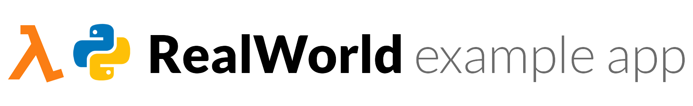

# 

> ### Python + AWS Lambda + DynamoDB codebase containing real world examples (CRUD, auth, advanced patterns, etc) that adheres to the [RealWorld](https://github.com/gothinkster/realworld) spec and API.

### [Demo](https://ldw3097.github.io/angularjs-realworld-example-app/build/#!/)

This codebase was created to demonstrate a fully fledged fullstack application built with **[Python + AWS Lambda + DynamoDB]** including CRUD operations, authentication, routing, pagination, and more.

We've gone to great lengths to adhere to the **[Python + AWS Lambda + DynamoDB]** community styleguides & best practices.

For more information on how to this works with other frontends/backends, head over to the [RealWorld](https://github.com/gothinkster/realworld) repo.

# How it works
- All informations needed for AWS cloud deployment are defined in `serverless/serverless.yml` and _serverless framework_ will automatically create AWS cloudformation stack.
- Used Moto and pytest to mock cloud environment and test codes.

# Getting started
## Prerequisite
- Install, Python, Node.js, Serverless CLI, AWS CLI

## Deploy
In `serverless` directory:
- `sls deploy`

## Test
In `serverless` directory:
- `pytest test/{testcode}`

